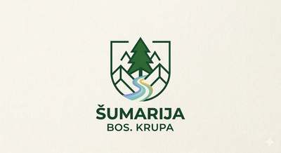

# 🎨 Login Screen Optimization - Visual Guide

## 📱 Responsive Design Showcase

### Desktop View (> 1024px)
```
┌────────────────────────────────────────────────────────┐
│                                                        │
│                      Purple Gradient                   │
│                   Background (animated)                │
│                                                        │
│         ┌─────────────────────────────┐               │
│         │                             │               │
│         │   [Logo - 240px width]      │               │
│         │   ŠPD "UNSKO-SANSKE ŠUME"   │               │
│         │     BOSANSKA KRUPA          │               │
│         │                             │               │
│         │       Šumarija               │ ← 42px heading
│         │ Evidencija sječe i otpreme  │               │
│         │                             │               │
│         │  ┌─────────────────────┐    │               │
│         │  │ Korisničko ime      │    │               │
│         │  └─────────────────────┘    │               │
│         │                             │               │
│         │  ┌─────────────────────┐    │               │
│         │  │ Šifra               │    │               │
│         │  └─────────────────────┘    │               │
│         │                             │               │
│         │  ┌─────────────────────┐    │               │
│         │  │   PRIJAVI SE        │ ← Gradient button
│         │  └─────────────────────┘    │               │
│         │                             │               │
│         └─────────────────────────────┘               │
│              520px max-width                          │
│              60px padding                             │
│                                                        │
│          Decorative circles (animated)                │
└────────────────────────────────────────────────────────┘
```

**Desktop Features:**
- ✅ Perfect vertical & horizontal centering
- ✅ Gradient background: `linear-gradient(135deg, #667eea, #764ba2)`
- ✅ Login box: `max-width: 520px`
- ✅ Padding: `60px 50px`
- ✅ Decorative circles (top-right, bottom-left)
- ✅ Smooth fade-in animation
- ✅ Logo hover effect (scale 1.05)
- ✅ Button hover effect (translateY -2px + shadow)

---

### Tablet View (768px - 1024px)
```
┌─────────────────────────────────────┐
│                                     │
│      Purple Gradient Background     │
│                                     │
│    ┌───────────────────────────┐   │
│    │                           │   │
│    │  [Logo - 220px width]     │   │
│    │  ŠPD "UNSKO-SANSKE ŠUME"  │   │
│    │    BOSANSKA KRUPA         │   │
│    │                           │   │
│    │      Šumarija              │ ← 40px
│    │ Evidencija sječe i otpreme│   │
│    │                           │   │
│    │ ┌───────────────────────┐ │   │
│    │ │ Korisničko ime        │ │   │
│    │ └───────────────────────┘ │   │
│    │                           │   │
│    │ ┌───────────────────────┐ │   │
│    │ │ Šifra                 │ │   │
│    │ └───────────────────────┘ │   │
│    │                           │   │
│    │ ┌───────────────────────┐ │   │
│    │ │   PRIJAVI SE          │ │   │
│    │ └───────────────────────┘ │   │
│    │                           │   │
│    └───────────────────────────┘   │
│         500px max-width            │
│                                     │
└─────────────────────────────────────┘
```

**Tablet Features:**
- ✅ max-width: `500px`
- ✅ Padding: `50px 45px`
- ✅ Logo: `220px`
- ✅ Same gradient & animations

---

### Mobile View (< 768px)
```
┌────────────────────────┐
│  Purple Gradient BG    │
│                        │
│ ┌────────────────────┐ │
│ │                    │ │
│ │ [Logo - 160px]     │ │
│ │ ŠPD "UNSKO-SANSKE  │ │
│ │      ŠUME"         │ │
│ │ BOSANSKA KRUPA     │ │
│ │                    │ │
│ │   Šumarija         │ │ ← 28px
│ │ Evidencija sječe   │ │
│ │   i otpreme        │ │
│ │                    │ │
│ │ ┌────────────────┐ │ │
│ │ │ Korisničko ime │ │ │
│ │ └────────────────┘ │ │
│ │                    │ │
│ │ ┌────────────────┐ │ │
│ │ │ Šifra          │ │ │
│ │ └────────────────┘ │ │
│ │                    │ │
│ │ ┌────────────────┐ │ │
│ │ │  PRIJAVI SE    │ │ │
│ │ └────────────────┘ │ │
│ │                    │ │
│ └────────────────────┘ │
│   Full width (100%)    │
│   Padding: 36px 28px   │
│                        │
└────────────────────────┘
```

**Mobile Features:**
- ✅ Full width responsive
- ✅ Compact padding: `36px 28px`
- ✅ Logo: `160px`
- ✅ Heading: `28px`
- ✅ NO decorative circles (performance)

---

## 🎨 Color Palette

### Background
```css
background: linear-gradient(135deg, #667eea 0%, #764ba2 100%);
```
- **Start:** `#667eea` (Purple Blue)
- **End:** `#764ba2` (Deep Purple)

### Login Box
```css
background: white;
box-shadow: 0 30px 80px rgba(0, 0, 0, 0.3);
border-radius: 20px;
```

### Button (Gradient)
```css
background: linear-gradient(135deg, #667eea 0%, #764ba2 100%);
box-shadow: 0 4px 15px rgba(102, 126, 234, 0.4);
```

### Input Focus
```css
border-color: #667eea;
box-shadow: 0 0 0 3px rgba(102, 126, 234, 0.1);
```

---

## ✨ Animations

### 1. Fade In Up (Login Box)
```css
@keyframes fadeInUp {
  from {
    opacity: 0;
    transform: translateY(30px);
  }
  to {
    opacity: 1;
    transform: translateY(0);
  }
}

animation: fadeInUp 0.6s ease;
```

### 2. Shake (Error Message)
```css
@keyframes shake {
  0%, 100% { transform: translateX(0); }
  10%, 30%, 50%, 70%, 90% { transform: translateX(-5px); }
  20%, 40%, 60%, 80% { transform: translateX(5px); }
}

animation: shake 0.5s ease;
```

### 3. Button Hover
```css
.btn:hover {
  transform: translateY(-2px);
  box-shadow: 0 6px 25px rgba(102, 126, 234, 0.5);
}
```

### 4. Logo Hover
```css
.logo-container img:hover {
  transform: scale(1.05);
}
```

---

## 📐 Responsive Breakpoints

| Device | Breakpoint | Max Width | Padding | Logo | Heading |
|--------|------------|-----------|---------|------|---------|
| **Desktop Large** | > 1024px | 520px | 60px 50px | 240px | 42px |
| **Tablet** | 768px - 1024px | 500px | 50px 45px | 220px | 40px |
| **Mobile** | < 768px | 100% | 36px 28px | 160px | 28px |
| **Extra Small** | < 480px | 100% | 30px 24px | 140px | 24px |

---

## 🚀 Performance Optimizations

### CSS Loading
```html
<link rel="preload" href="css/login-optimized.css" as="style">
<link rel="stylesheet" href="css/login-optimized.css">
```

### File Size
- **login-optimized.css:** 7.1KB
- **Gzipped:** ~2KB (estimated)

### GPU Acceleration
All animations use CSS transforms (not position/width/height):
```css
transform: translateY(-2px);  /* GPU accelerated ✅ */
top: -2px;  /* CPU only ❌ */
```

---

## 🌙 Dark Mode Support

```css
body.dark-mode .login-box {
  background: #1f2937;
  color: #f9fafb;
}

body.dark-mode .form-group input {
  background: #374151;
  border-color: #4b5563;
  color: #f9fafb;
}
```

**To enable:**
```javascript
document.body.classList.add('dark-mode');
```

---

## 🎯 Accessibility Features

### 1. Form Labels
```html
<label>Korisničko ime</label>
<input id="username" autocomplete="username">
```

### 2. ARIA Attributes
- Proper label-input associations
- Focus visible states
- High contrast colors

### 3. Keyboard Navigation
- Tab order preserved
- Enter to submit
- Escape to clear (optional)

---

## 📝 HTML Structure

```html
<body class="login-active">
  <div id="login-screen" class="login-container">
    <div class="login-box">
      <div class="logo-container">
        
        <h3 class="text-outline-firma">ŠPD "UNSKO-SANSKE ŠUME"</h3>
        <h4 class="company-subtitle">BOSANSKA KRUPA</h4>
      </div>

      <h2>Šumarija</h2>
      <p>Evidencija sječe i otpreme</p>

      <form id="login-form">
        <div id="error-msg" class="error hidden"></div>

        <div class="form-group">
          <label>Korisničko ime</label>
          <input type="text" id="username"
                 placeholder="Email ili username"
                 required
                 autocomplete="username">
        </div>

        <div class="form-group">
          <label>Šifra</label>
          <input type="password" id="password"
                 placeholder="••••••••"
                 required
                 autocomplete="current-password">
        </div>

        <button type="submit" class="btn">Prijavi se</button>
      </form>
    </div>
  </div>
</body>
```

---

## 🔄 Build & Deploy

### Build
```bash
./build-final.sh
```

### Deploy
```bash
git add index.html css/login-optimized.css
git commit -m "🎨 Optimized login screen"
git push
```

---

## 📊 Before vs After Comparison

### Before
- ❌ Not centered on desktop
- ❌ Plain white background
- ❌ No animations
- ❌ Basic styling
- ❌ Not optimized for large screens

### After
- ✅ Perfect centering on all devices
- ✅ Beautiful gradient background
- ✅ Smooth animations
- ✅ Modern professional design
- ✅ Fully responsive (mobile to 4K)

---

## 🎉 Final Result

**Desktop Experience:**
- Gradient purple background
- Centered login box with shadow
- Decorative animated circles
- Smooth fade-in entrance
- Hover effects everywhere
- Professional modern look

**Mobile Experience:**
- Full width optimization
- Touch-friendly inputs
- Compact but readable
- Fast loading
- Smooth transitions

**Universal:**
- Consistent branding
- Accessible design
- High performance
- Beautiful on all devices

---

**Enjoy your beautiful login screen!** 🎨✨
